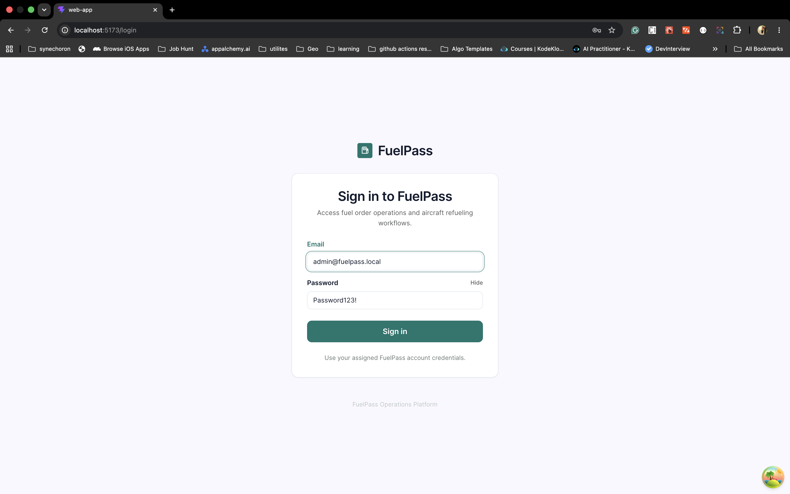
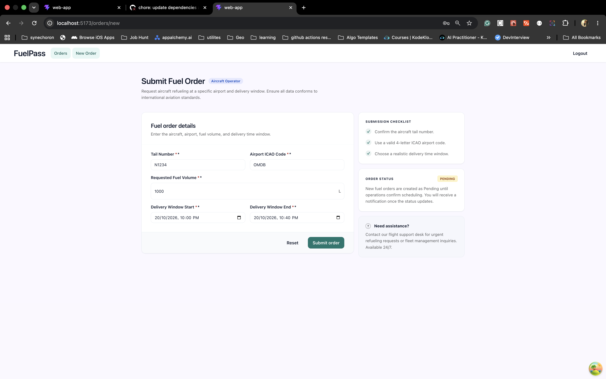
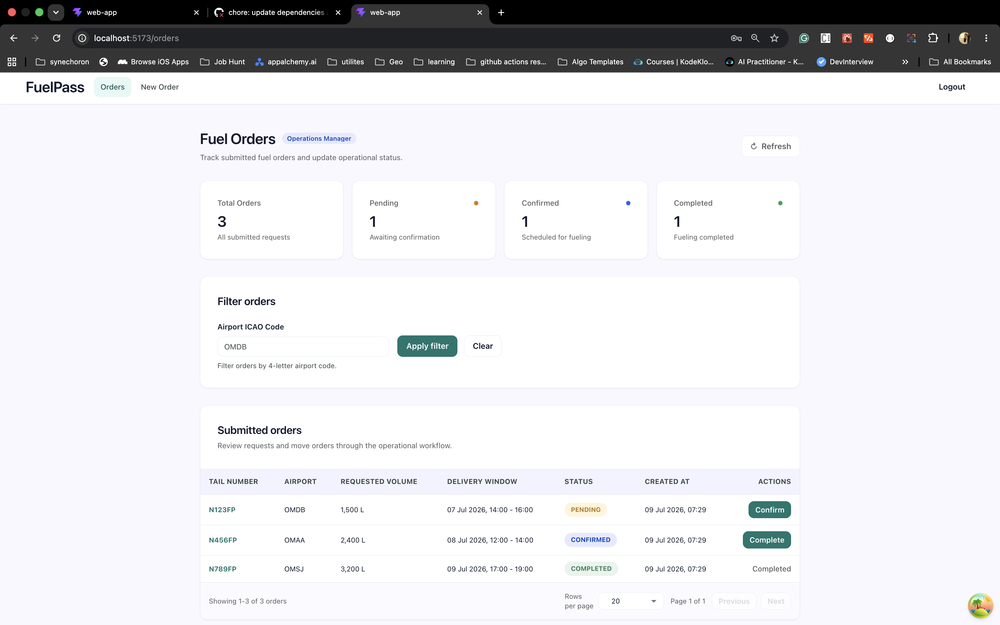
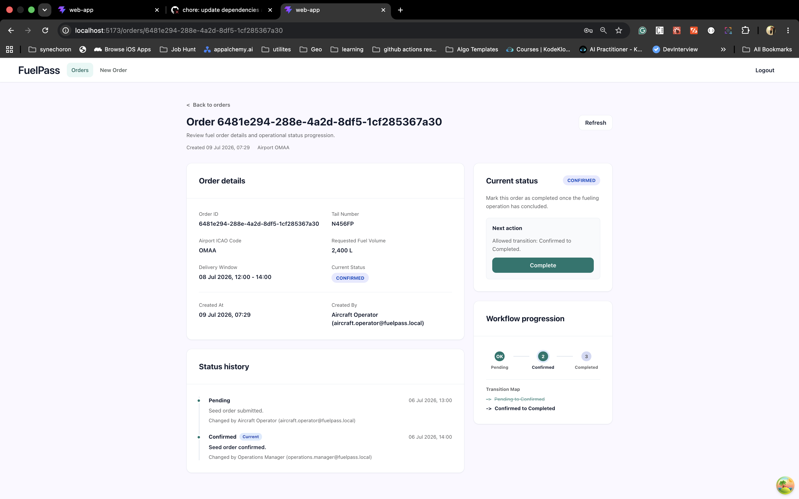

# Fuel Pass

Fuel Pass is a TypeScript monorepo for an aviation fuel ordering flow. It has a web app, two NestJS API services, and a small proxy that gives the frontend one base URL to call during local development.

The main backend workspaces are:

- `@fuel-pass/auth-service`: users, credentials, sessions, JWTs, roles, permissions, and internal auth introspection.
- `@fuel-pass/orders`: fuel order creation, listing, lookup, status changes, and permission-aware access rules.
- `@fuel-pass/proxy-service`: an HTTP gateway that forwards `/auth-service` and `/orders-service` traffic to the right service.

Shared code lives in `packages/`. The most important shared packages are `@fuel-pass/contracts` for DTOs, permissions, and error catalogs, and `@fuel-pass/node-commons` for backend utilities.

## Screenshots









## Requirements

- Node.js `^20.19.0`, `^22.13.0`, or `>=24`
- npm `^10.9.0`
- Docker, if you want the local Postgres setup
- PostgreSQL, if you prefer running Postgres without Docker

SQLite is also supported for quick local review and integration tests.

## Install

Install dependencies from the repository root:

```sh
npm install
```

Then generate the local `.env` files:

```sh
npm run setup:envs
```

`setup:envs` reads `.env.example`, removes the service prefixes, and writes these files:

- `apps/api/auth-service/.env`
- `apps/api/orders-service/.env`
- `apps/api/proxy-service/.env`
- `apps/web/web-app/.env`

For example, `AUTH-PORT=3000` in `.env.example` becomes `PORT=3000` inside `apps/api/auth-service/.env`.

The generated defaults use:

- auth service: `http://localhost:3000/api`
- orders service: `http://localhost:3001/api`
- proxy service: `http://localhost:3100`
- web app API base URL: `http://localhost:3100`
- Postgres host port: `5433`

## Run With Docker Postgres

The easiest Postgres path is the Docker setup:

```sh
npm run docker:up
```

This runs `docker compose up -d` with values from `docker.env`.

The Compose file starts two containers:

- `postgres`: PostgreSQL 16 on host port `5433`
- `db-init`: a one-shot setup container that waits for Postgres to become healthy, then creates `fuel_pass_auth` and `fuel_pass_orders` if they do not already exist

After Postgres is running and the `.env` files are generated, run migrations and seed data:

```sh
npm run db:setup
```

The root `db:setup` script runs setup for both service databases:

```sh
npm run db:setup -w @fuel-pass/auth-service
npm run db:setup -w @fuel-pass/orders
```

Inside each service, `db:setup` runs TypeORM migrations first and then the seed script.

## Run The App

Start all development tasks through Turbo:

```sh
npm run dev
```

Or run services one at a time:

```sh
npm run start:dev -w @fuel-pass/auth-service
npm run start:dev -w @fuel-pass/orders
npm run dev -w @fuel-pass/proxy-service
npm run dev -w @fuel-pass/web-app
```

Useful health checks:

```sh
curl http://localhost:3000/api/health
curl http://localhost:3001/api/health
curl http://localhost:3100/health
curl http://localhost:3100/health/deep
```

Proxy routes are namespaced:

```sh
curl http://localhost:3100/auth-service/api/health
curl http://localhost:3100/orders-service/api/health
```

## Open And Log In

Once the API services, proxy, and web app are running, open the web app:

```text
http://localhost:5173
```

The auth seed creates these local users:

| Role               | Email                               | Password       |
| ------------------ | ----------------------------------- | -------------- |
| Admin              | `admin@fuelpass.local`              | `Password123!` |
| Aircraft Operator  | `aircraft.operator@fuelpass.local`  | `Password123!` |
| Operations Manager | `operations.manager@fuelpass.local` | `Password123!` |

Use the aircraft operator account to create fuel orders. Use the operations manager or admin account to review broader order activity and status workflows.

## SQLite Setup

SQLite is useful when you want a lightweight local run without starting Postgres.

First generate the env files:

```sh
npm run setup:envs
```

Then edit `apps/api/auth-service/.env` and switch the database settings to SQLite:

```dotenv
DB_TYPE=sqlite
SQLITE_DATABASE=./auth.sqlite
SQLITE_SYNCHRONIZE=true
```

Comment out or remove the Postgres values in that same file:

```dotenv
# DB_TYPE=postgres
# DB_HOST=localhost
# DB_PORT=5433
# DB_USERNAME=postgres
# DB_PASSWORD=postgres
# DB_DATABASE=fuel_pass_auth
# DB_SSL=false
```

Do the same for `apps/api/orders-service/.env`:

```dotenv
DB_TYPE=sqlite
SQLITE_DATABASE=./orders.sqlite
SQLITE_SYNCHRONIZE=true
```

And comment out or remove the orders Postgres values:

```dotenv
# DB_TYPE=postgres
# DB_HOST=localhost
# DB_PORT=5433
# DB_USERNAME=postgres
# DB_PASSWORD=postgres
# DB_DATABASE=fuel_pass_orders
# DB_SSL=false
```

With SQLite, `SQLITE_SYNCHRONIZE=true` lets TypeORM create the local schema automatically. You can still run the seed scripts if you want default development data:

```sh
npm run seed -w @fuel-pass/auth-service
npm run seed -w @fuel-pass/orders
```

SQLite database files are created inside each service folder. They are local development files and should not be committed.

## Test And Validate

Run the full workspace test task:

```sh
npm run test
```

Run focused tests:

```sh
npm run test -w @fuel-pass/auth-service
npm run test -w @fuel-pass/orders
npm run test -w @fuel-pass/proxy-service
```

Other validation commands:

```sh
npm run build
npm run lint
npm run check-types
npm run format
```

Coverage is available for the service workspaces:

```sh
npm run test:cov -w @fuel-pass/auth-service
npm run test:cov -w @fuel-pass/orders
npm run test:cov -w @fuel-pass/proxy-service
```

## Notes

- Auth is the source of truth for users, roles, permissions, sessions, and token issuance.
- Orders stores order data and asks auth for user and permission context through the internal auth API.
- Permission keys and error codes belong in `@fuel-pass/contracts` so the services and clients share the same vocabulary.
- The example secrets and RSA keys are for local development only. Do not reuse them in production.
- For a production-like local setup, prefer Postgres with migrations. Use SQLite for quick review and isolated tests.
